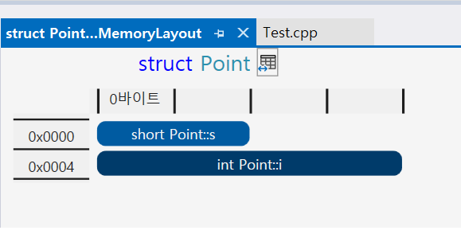

## struct 


````c++

struct Point
{
	short s;
	int i;
};

int main()
{
	Point p;

	return 0;
}


````



- 위 struct point는 2 + 4 총 6byte일 것같지만 바이트 패딩이 적용되어 4 + 4 -> 8byte의 크기가 할당된다.

- 패딩이 적용되는 이유는.. 속더 이점일 살리기 위해서 그렇다. 왜 ?


## 오버로딩

- 리턴 타입은 오버로딩과 상관없다.


## 참조와 포인터

- 참조는 실제가 있어야하며 선언 즉시, 할당외어야함

- 포인터는 주소값을 저장할 수 있는 타입의 변수.


## 댕글링 포인터

- 포인터 변수를 delete나 free를 했다해도, 변수가 가리키는 주소값이 사라지는 것이 아니라 메모리가 free되는 것이다. 그래서 메모리를 해제한 후 nullptr로 바꿔준 후 다음에 사용할 때 nullptr인지 체크하는 구문이 필수적으로 필요함


- 사용하지 않지만 예전에 사용했던 포인터.. 


## 가상함수

- 추상 클래스는 인스턴스화 할 수없다.
    - c#에는 abstract, c++에도 abstract 가 추가 됌 
    - abstract는 명시적 키워드 (이것은 추상이다 보여주는 용도)
    - 추상크래스는 순수가상메서드가 하나 이상 존재함


## 가상 메모리 

- 가상 메모리... 메모리 관리의 최소 단위가 1BYTE. 


- 32bit일 경우 vms(virtual memory system)에서 앞뒤를 자르는데 2G(user mode), 2G(kernel mode)
	- 32bit -> 4byte -> 42억정도.. 4G
	- usermode의 앞쪽 부분도 os가 사용해서 실 사용은 1.8G정도.
	- 

- 메모리 메니저(memory manager), 메모리 관리자는 커널단에있다.
  - 관리할 수 있는 최대크기는 RAM + SWAP 영역 
  - SWAP영역은 OS가 자율적으로함
  - SWAP을 자주 사용하면 IO 가 떨어짐
  - 동적 주소 변환 -> RAM + SWAP 영역
  - 가상 메모리에서는 프로세스마다 각자 고유 메모리 공간을 가짐 첫 부분은 0..
    - 그렇지만 실제 물리적 메모리의 위치는 다 다르다..
- 메모리 매니저가 맵핑 테이블을 가지고있다.
-   https://www.youtube.com/watch?v=-jlzaslp-w4
-   
	- 스왑됐다 프로세스가, hdd로 옮겨졌다. 
	- https://www.youtube.com/watch?v=-jlzaslp-w4

## 32BIT 환경과 64BIT 환경 

## - 메모리 단편화의 두 가지 경우를 설명하고, 해결 방법을 제시하시오

## volatile이란 무엇인가?


## 