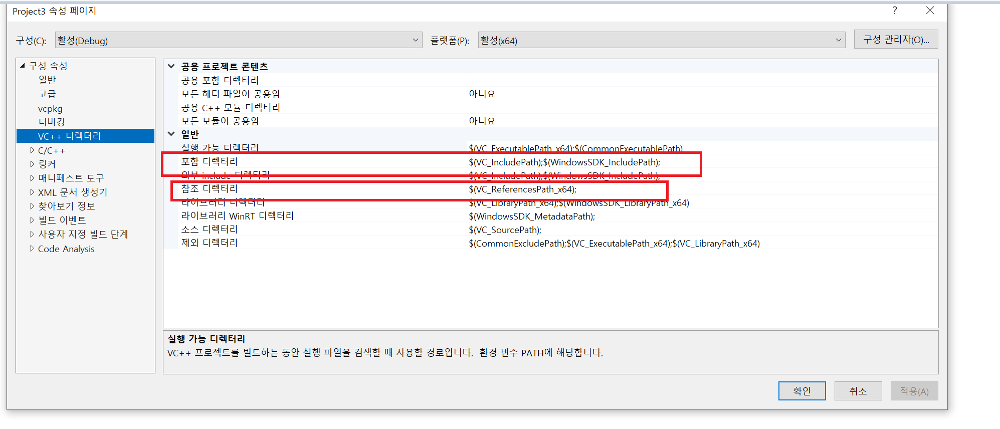

## pch.h 설정

- visual studio에서 미리 컴파일된 헤더를 사용하는 이유는 여러 파일들에서 공용으로 사용할 파일들을 한쪽으로 모아놓고 관리하기 위해서이다 

- 또한 pch.h에 넣어 놓은 후 #pragma once를 하게되면 변경점이 없을 때는 컴파일을 하지 않아서 속도 향상에도 이점이 존재한다. 

- pch.h 설정에서 실 수 할 수 있는 부분들이 존재하는데 1. pch.h 헤더 만들고,  2. 프리 컴파일 헤더 사용하기까지는 했지만 3. !!! pch.cpp 파일에서 프리 컴파일 헤더 만들기를 추가해줘야한다. 

- 3번 항목을 놓쳐서 계속해서 문제가 발생했던 부분들이 존재했다.. 

## vc++ 디렉토리 추가하기 

- visual studio에서 정적 lib들을 현재 사용하고 있는 프로젝트에서 참조하길 원할 수 있다. 그럴 때 사용할 수 있는 방법이 
  - c/c++ -> 일반 -> 추가 포함 디렉토리에서 참조할 디렉토리를 추가 한다. 
  - 디렉터리를 추가한 후 해당 lib파일을 링커끼리 연결 인식을 시키기 위해서 링커 -> 일반 -> 추가 라이브러리 디렉토리에 .lib파일드을 추가할 수 있다.  

- 위 방법은 두 곳을 찾아서 디렉터리 추가, 링킹할 수 있는 lib파일을 추가하는 방법인데 한번에 vc++ 디렉토리 추가화면에서 수정할 수 있다.. 
  
  

- 위 사진에서 포함 디렉터리는 추가할 디렉터리 위치를 넣어주면되고, 참조 디렉터리에는 .lib파일들을 연결해 놓으면된다. 