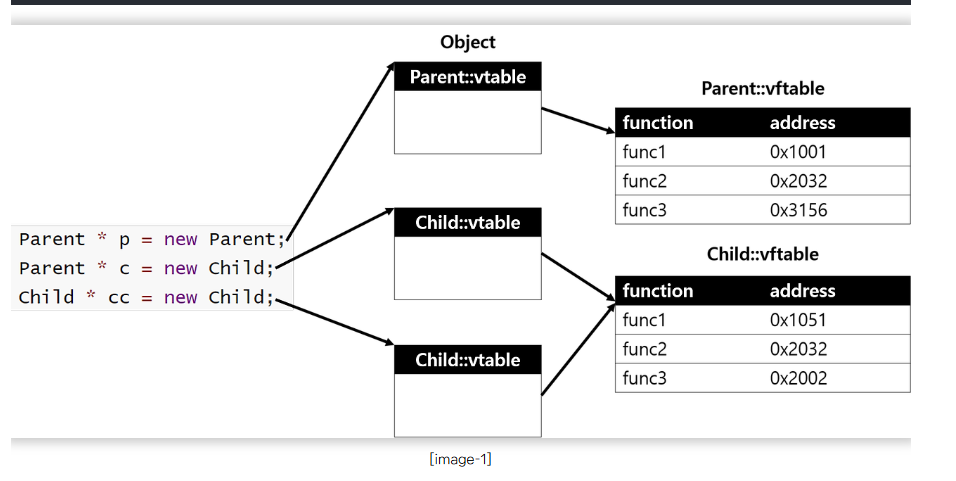

## 다형성과 가상함수

-  다형성 => 겉은 똑같은데 기능이 다르게 동작하는 것이다.

- 오버로딩 : 함수 이름의 재사용 매개변수만 변화를 준 것이다 
- 오버라이딩 : 부모클래스의 함수를 자식 클래스에서 재정의 

- 일반 함수는 정적바인딩으로 컴파일 시점에서 결정이된다, 그러나 가상함수(virtual) 동적바인딩으로 묶이게된다.

- 가상함수 virtual을 사용하면 .vftable이 생기고 실제로 가리키는 곳이 생긴다. [vMove][vDie] 

*/

````c++
#include <bits/stdc++.h>

using namespace std;


class Player
{
public:
	virtual void Move() 
	{
		 cout << "Move Player! " << endl; 
	}

public:
	int _hp;
};

class Knight : public Player
{
public:
	int _stamina;
};
class Mage : public Player
{
public:
	int _mp;
};

//Player 객체 주소의 첫번째에 가리킬 이정표를 가지고 있다고 생각하면된다.
void MovePlayer(Player *player)
{
	player->Move();
}
int main() {


	return 0;
}
````


## 자세한 vtable 

````c++
class Parent{
    virtual void func1(){
        AAA
    }
    virtual void func2(){
        BBB
    }
    virtual void func3(){
        CCC
    }
    void func4(){
        DDD
    }
}

class Child : public Parent{
    virtual void func1(){
        childA
    }
    virtual void func3(){
        childC
    }
}

int main(){
    Parent * p = new Parent;
    Parent * c = new Child;
    Child * cc = new Child;

    p->func1(); // Parent의 func1 함수 호출
    c->func1(); // Child의 Overriding 된 func1 호출
    c->func2(); // Parent의 func2 함수 호출
    c->func4(); // Parent의 func4 함수 호출, 가상테이블엔 없음 
    cc->func3(); // Child의 func3 함수 호출
}
출처: https://cosyp.tistory.com/228 [nothing blog:티스토리]
````

- 

- 위 사진에서도 보듯이, 같은 함수더라도 Child에서 오버라이딩 된 함수 func1, func3은 주소가 다르고 오버라이딩 되지 않은 함수 func2는 주소가 동일하다. 

- 자식 클래스의 vtable은 부모 클래스의 virtual table 값이 그대로 복사되며, 오버라이딩 된 함수만 주소가 새로 업데이트된다.  

- 자식 클래스에 부모에 없는 새로운 가상 함수를 추가할 경우, 객체 virtual table의 마지막 부분에 추가된다. 

- virtual 키워드 가상 함수 

출처 : https://cosyp.tistory.com/228