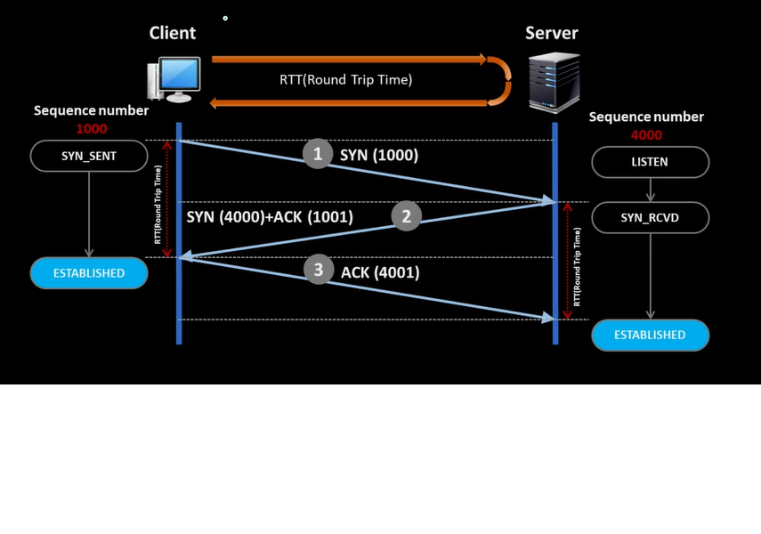

## tcp

- 소켓프로그래밍을 할 때 식당운영에서 손님, 안내원, 대표 이런식으로 설명을 하였다.

## tcp 연결 - 해지 

- tcp는 연결할 때 3 - way handshaking으로 연결되고, 해지될 때는 4 - way handshaking으로 해지된다.

- 3-way handshaking..
	- client가 랜덤으로 생성된 sequence number를 server로 보낸다  //  syn(sequence number)
	- server는 listen을하고 있다가 client의 요청이온다면 sync_recv를한다 그후 server는 client에게 sync + ack(잘받았다~ client의 sync + 1)를 전송한다.
	- client도 server의 sync + ack를 받은 후 잘 받았다는 의미로 server로 ack(server의 sequence number + 1)을 보낸다.
	- tcp는 통신의 sequence number를 교환하는 것 + 정책을 서로에게 알려주는 것이다 예를들어 server의 mss(maximum segment size)는 1460이다. client의 mss는 1500이다.를 서로 합의하는 과정이다.(sync 패킷 옵션 필드에 자신의 mss값을 알린다)
	- 또한 tcp연결중에 교환되는 segment들은 payload가 없는 것고 ip, tcp부분의 헤더만 존재한다고 보면된다.


	- cf : segment는 tcp단에서 데이터의 단위를 말한다. mss는 tcp 세그먼트의 최대 데이터크기, tcp 및 ip 헤더를 제외한 순수 데이터 페이로드를 의미한다.
	- mss와 mtu를 비교하자면 mtu는 네트워크 인터페이스가 전송할 수 있는 최대 패킷크기, 여기서는 ip 및 tcp의 헤더를 포함한다.


### DummyClient 부분 

````
#include "pch.h"
#include <iostream>

#include <WinSock2.h>
#include <MSWSock.h>
#include <WS2tcpip.h>

#pragma comment(lib, "ws2_32.lib")
int main()
{
	WSADATA wsaData;
	if (::WSAStartup(MAKEWORD(2, 2), &wsaData) != 0)
		return 0;

	// ad : Address Family (AF_INET = IPv4, AF_INET6 = IPv6)
	// type : TCP(SOCK_STREAM) VS UDP(SOCK_DGRAM)
	// protocol : 0
	// return : descriptor
	SOCKET clientSocket = ::socket(AF_INET, SOCK_STREAM, 0);
	if (clientSocket == INVALID_SOCKET)
	{
		int32 errorCode = ::WSAGetLastError();

		cout << "Socket ErrorCode : " << errorCode << endl;
		return 0;
	}

	//연결할 목적지
	// 출처 : msdn connect...
	// The sockaddr_in structure specifies the address family,
	// IP address, and port of the server to be connected to.
	SOCKADDR_IN serverAddr;
	::memset(&serverAddr, 0, sizeof(serverAddr));

	serverAddr.sin_family = AF_INET;
	// serverAddr.sin_addr.s_addr = ::inet_addr("127.0.0.1"); << deprecated
	::inet_pton(AF_INET, "127.0.0.1", &serverAddr.sin_addr);

	serverAddr.sin_port = ::htons(7777);   // port 포트 번호 
	//htons host to network short

	//Little-Endian -> low [0x56][0x35][0x12].. high
	//Big- Endian -> low [0x12][0x34][0x56]..  high


	if (::connect(clientSocket, (SOCKADDR*)&serverAddr, sizeof(serverAddr)) == SOCKET_ERROR)
	{
		int32 errorCode = ::WSAGetLastError();

		cout << "Connect ErrorCode : " << errorCode << endl;
	}

	cout << "Connected To Server" << endl;

	while (true)
	{
		char sendBuffer[100] = "Hello world";
		
		for (int i = 0; i < 10; i++)
		{
			int32 resultCode = ::send(clientSocket, sendBuffer, sizeof(sendBuffer), 0);
			cout << "Send Data Len : " << sizeof(sendBuffer) << endl;
		}
		
		

		//-------------------------server에서 보낸 것을 recv

		//char recvBuffer[1000];

		//int recvLen = ::recv(clientSocket, recvBuffer, sizeof(recvBuffer), 0);

		////SOCKET_ERROR가 -1인데 0보다 작으면 에러라고 보자!
		//if (recvLen <= 0)
		//{
		//	int32 errCode = ::WSAGetLastError();
		//	cout << "Rcv ErrorCode : " << errCode << endl;
		//	return 0;
		//}
		//cout << "Rcv Data : " << recvBuffer << endl;

		//this_thread::sleep_for(1s);

	}
	::closesocket(clientSocket);

	::WSACleanup();
}
````

### server 부분
````
#include "pch.h"
#include <iostream>
#include <atomic>
#include <mutex>

#include <future>
//#include "ThreadManager.h"

#include <winsock2.h>
#include <mswsock.h>
#include <ws2tcpip.h>
#pragma comment(lib, "ws2_32.lib")

int main()
{
	// 윈속 초기화 (ws2_32 라이브러리 초기화)
	// 관련 정보가 wsaData에 채워짐
	WSAData wsaData;
	if (::WSAStartup(MAKEWORD(2, 2), &wsaData) != 0)
		return 0;

	// ad : Address Family (AF_INET = IPv4, AF_INET6 = IPv6)
	// type : TCP(SOCK_STREAM) vs UDP(SOCK_DGRAM)
	// protocol : 0
	// return : descriptor
	//현재 listenSocket는 접속을 할 때만 사용
	SOCKET listenSocket = ::socket(AF_INET, SOCK_STREAM, 0);
	

	// 나의 주소는? (IP주소 + Port)->XX 아파트 YY 호
	SOCKADDR_IN serverAddr; // IPv4
	::memset(&serverAddr, 0, sizeof(serverAddr));
	serverAddr.sin_family = AF_INET;
	serverAddr.sin_addr.s_addr = ::htonl(INADDR_ANY); //< 니가 알아서 해줘
	serverAddr.sin_port = ::htons(7777); // 80 : HTTP

	// 안내원 폰 개통! 식당의 대표 번호
	if (::bind(listenSocket, (SOCKADDR*)&serverAddr, sizeof(serverAddr)) == SOCKET_ERROR)
	{
		int32 errCode = ::WSAGetLastError();
		cout << "Bind ErrorCode : " << errCode << endl;
		return 0;
	}

	// 영업 시작!
	if (::listen(listenSocket, 10) == SOCKET_ERROR)
	{
		int32 errCode = ::WSAGetLastError();
		cout << "Listen ErrorCode : " << errCode << endl;
		return 0;
	}

	// -----------------------------

	while (true)
	{
		SOCKADDR_IN clientAddr; // IPv4
		::memset(&clientAddr, 0, sizeof(clientAddr));
		int32 addrLen = sizeof(clientAddr);

		//clientSocket실질적인 데이터 주고 받는 소켓 
		SOCKET clientSocket = ::accept(listenSocket, (SOCKADDR*)&clientAddr, &addrLen);
		if (clientSocket == INVALID_SOCKET)
		{
			int32 errCode = ::WSAGetLastError();
			cout << "Accept ErrorCode : " << errCode << endl;
			return 0;
		}

		// 손님 입장!
		char ipAddress[16];
		::inet_ntop(AF_INET, &clientAddr.sin_addr, ipAddress, sizeof(ipAddress));
		cout << "Client Connected! IP = " << ipAddress << endl;

		// TODO
		while (true)
		{
			//recvBuffer는 상대방이 보낼 크기를 예측할 수 없다.
			char recvBuffer[1000];

			this_thread::sleep_for(1s);
			int recvLen = ::recv(clientSocket, recvBuffer, sizeof(recvBuffer), 0);

			//SOCKET_ERROR가 -1인데 0보다 작으면 에러라고 보자!
			if (recvLen <= 0)
			{
				int32 errCode = ::WSAGetLastError();
				cout << "Rcv ErrorCode : " << errCode << endl;
				return 0;
			}
			cout << "Rcv Data : " << recvBuffer << endl;
			cout << "Rcv Len : " << recvLen << endl;

			////-------echo server느낌!
			//char sendBuffer[100] = "Hello world";

			//int32 resultCode = ::send(clientSocket, recvBuffer, sizeof(recvBuffer), 0);
			//if (resultCode == SOCKET_ERROR)
			//{
			//	int32 errCode = ::WSAGetLastError();
			//	cout << "send Error : " << errCode << endl;
			//	return 0;
			//}
			//cout << "Send Data Len : " << sizeof(sendBuffer) << endl;

		}
	}

	// -----------------------------


	// 윈속 종료
	::WSACleanup();
}
````


- server코드의 listen은 딱 처음 접속할 때만 사용된다 실질적으로 client쪽과 통신할 소켓은 accept할 때 나오는 clientSocket이다..

- 

-출처 : https://docs.microsoft.com/en-us/windows/win32/api/winsock2/nf-winsock2-connect