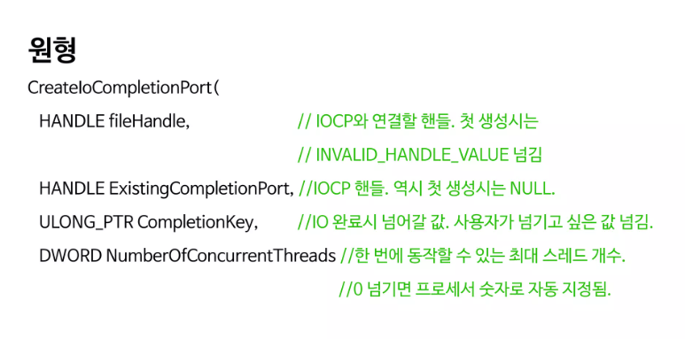
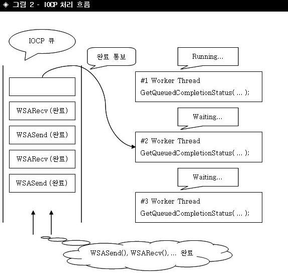

- 소켓프로그래밍이 tcp udp부터 시작해서 select wsaEvent, overlapped, .. 까지해서 IOCP가 나오기까지를 확인해보자.

- 각 모델 별로 장단점을 정리하면서 IOCP의 특정도 적어 놓겠습니다.

````

------------------- select 모델  (안드로이드에서 하면 문제가 없다, 안드로이드는 linux플랫폼기반이니)
	-장점 : 윈도우 리눅스 공통
	-단점 : 성능이 안좋다 왜냐? 소켓set에 계속해서 등록을 해줘야하기에, 갯수 제한 64개
 ----------------------------wsaEventSelect 모델-------------------------------------------
	- 비교적 뛰어난 성능이지만 64개 갯수제한이 동일하게 있다
------------------------------------------------- Overlapped (이벤트 기반)------------------------
	- 장점은 성능이 좋다 단점은 64개로 갯수제한
 ------------------------------Overlapped (콜백 기반)------------------------------------------
	1.성능이 좋지만 단점은 모든 비동기 소켓 함수에서 사용가지않다 (accept에는 callback을 걸 수가없다)
   	2. 빈번한 alertable wait로 인한 성능이 저하된다.
    3. apc큐자체가 쓰레드별로 각자있다. 다른 쓰레드가 대신 처리를 못한다는 단점이 있따.


````

- Reactor Pattern (논블로킹 소켓인데 소캣 상태를 확인후 뒤늦게 RECV, SEND를 호출한다)

- Proactor Pattern (미리 RECV나 SEND를 하고, overlapped WSA로 미리 걸어 놓은 후 내부적으로 처리하도록한다


### IOCP (Completion Port) 모델

- Overlapped 콜백 방식에 있었던 APC개념을  Completion Port로 대체했는데 쓰레드마다 있는건 아니고 1개만 있다 중앙에서 관리하는 큐느낌이다

-  Completion Port처리를 GetQueueCompletionStatus

- iocp의 port는 socket에서의 port와 느낌이다르다 socket port는 bind 시 port를 
엮는 것인데 iocp의 port(completion port)는 포트랑 스레드를 묶는 것이다. 
- 워커 스레들 중 하나가 cp에서 입출력 완료를 꺼냄 

- IO(RECV, SEND) 작업에서 동시 수행되는 스레드 개수의 상한선을 설정하여 CPU를 효율적으로 사용하자



- CreateIoCompletionPort는 두번 사용되는데 iocp 핸들을 생성할 때 그리고 socket을 cp에 등록할 때 2번째인자인 ExistingCompletionPort에 null이면 iocp 핸들 생성이라고 생각하면 됌  

-GetQueuedCompletionStatus에서 TimeOut 에러는 괜찮음
	- Timeout 에러는 단순히 함수가 호출된 시점에서 처리할 완료된 I/O 작업이 없다는 것을 나타내며, 이는 비동기 I/O 작업이 아직 완료되지 않았거나, 아직 처리해야 할 작업이 없다는 것을 의미합니다.

- 네트워크처리에서 IO 작업(DB작업이나 파일 작업 ..)이 작업이 시간이 많이 걸린다. 

- 패킷처리 스레드랑, IO 처리를 엮으면안된다 => IO처리는 시간이 많이 걸리는 이유때문에..
	- IO처리를 비동기로하기도하는데 스레드를 하나를 이용해서 처리할 때 CPU가 멈추는 것을 막기 위해서 비동기로 처리한다.
		- 다른 모팀에서는 IO작업을 동기로하기도한다 (멀티스레드 환경)

- Window OS가 직접 효율적인 Thread Pooling을 지원(Context Swithing을 줄이는 효과)

- 입출력 장치를 IOCP에 등록하자(소켓 서버 프로그래밍이므로 입출력 장치는 소켓이다)

- Proactor vs reactor
  - Proactor '미리 대비하는 것' , 작업을 시켜놓은 후 그 작업이 완료되면 그때 그 완료에 대한 처리를 수행
  - Proactor는 reactor처럼 작업이 완료되는 '완료 여부'를 매번 확인하는 것이 아니다
  - os가 내부적으로 비동기 작업을 수행한 뒤 완료되면, application에게 io 작업이 완료됌을 알려준다. 

````
IOCP를 생성하면

I/O Completion Queue(* FIFO 선입 선출방식)
Wating Thread Queue(* LIFO 선입 후출방식)
Release Thread List
Paused Thread List

이 추가된다.

````
- Release Thread List
  - I/O 완료 패킷이 I/O 완료 큐에 추가되면, 대기 중인 스레드 큐에서 스레드 하나가 해제되어 이 목록에 추가되고, 완료된 I/O 작업을 처리하도록 예약됩니다 (user mode)

-  Waiting Thread Queue
   -  이 큐에는 I/O 완료 알림을 기다리고 있는 스레드가 포함되어 있습니다. 애플리케이션 스레드가 GetQueuedCompletionStatus 또는 GetQueuedCompletionStatusEx를 호출했을 때 완료된 I/O 패킷이 없으면, 해당 스레드는 이 대기 중인 스레드 큐에 들어갑니다. (user mode)
  
-   I/O Completion Queue
	- : I/O 작업이 완료되면 해당 작업의 결과가 이 큐에 저장됩니다. 커널이 I/O 작업을 완료하면 관련된 완료 패킷이 I/O 완료 큐에 쌓입니다. 이 큐는 완료된 I/O 작업에 대한 정보(예: 전송된 바이트 수, OVERLAPPED 구조체에 대한 포인터, 완료 키)를 보유합니다. (커널 모드)
  
- 성능을 위해 
#### 이점

- Overlapped IO 지원
  - 커널영역과 유저영역의 버퍼 공유 (memory page - locking)
````
Memory Page Locking은 특정 메모리 페이지가 스왑되지 않도록 메모리에 고정하는 과정입니다. 이는 특히 Overlapped I/O 작업에서 중요한 역할을 합니다. Overlapped I/O 작업에서 데이터 버퍼가 스왑될 경우 I/O 작업의 성능과 안정성에 문제가 발생할 수 있습니다. 이를 방지하기 위해 데이터 버퍼를 메모리에 고정(lock)하여 스왑되지 않도록 합니다.
````
	- Overlapped I/O 작업이 진행되는 동안 데이터 버퍼가 스왑되지 않도록 보장하여, 데이터 무결성을 유지합니다.
	- 데이터 버퍼가 스왑되지 않으므로, I/O 작업의 성능이 향상됩니다. 스왑 작업은 매우 비용이 많이 드는 작업이므로, 이를 방지하는 것이 중요합니다.

#### 질문 

- iocp의 스레드풀 관리 방법은?

- Overlapped IO?

- paging locking 을 최소화하는 방법?

- so_rcvbuf ?

- send, recv
  - nic 버퍼에서 유저레벨 이동 흐름을 설명 

- IOCP 모델관련 그림들을 찾아보면 장치리스트, 레코드라는 것들이 존재한다.
  - 장치 리스트는 IOCP와 연결된 장치들의 정보를 관리하는 것
   
#### iocp model 그림 



#### 1 - Send 구현 
- GQCS(GetQueuedCompletionStatus) 

- Send 호출 시 WSASend를 바로 호출하는 것이 아니라 Queue에 담아 놓는다

- 해당 Queue에서 담긴 데이터가 2개이상이면 send를 하면안된다  왜냐? 이전 send가 완료되지 않았기 때문이다. 
	- send가 완료될 때는 GQCS에서 알 수 있고, GQCS 처리 후 QUEUE에 있는 SEND 데이터를 하나 지운다. 
- https://www.slideshare.net/namhyeonuk90/iocp

#### WSASend
- send의 비동기라 생각하면된다. 

- WSASend가 실행되면 바로 send가 되는 것이 아니라... 


#### Accept 비동기로 구현 

- Accept(동기함수) -> AcceptEx() 사용 

- AcceptEx 이점 
	- 초기에 동접이 많이 몰릴때 이점이있다
	- IOCP는 PROACTOR방식인데 ACCEPT방식은 REACTOR방식이다. (accept는 클라이언트 연결 요청이 올 때까지 기다렸다가, 연결요청이 오면 그때 연결을 수락함 )
	- 
#### 참고 

- 로직용 (Packet Thread), 네트워크 처리용 Thread 분리.. 패킷처리 queue에 실행할 일감들도 넣어도ㅑㅇ함 


### 참고 

- https://www.slideshare.net/slideshow/overlapped-io-iocp-77947351/77947351#2
- https://www.slideshare.net/slideshow/iocp-advanced/46781725
- https://www.slideshare.net/slideshow/iocp-advanced/46781725
- https://jungwoong.tistory.com/43