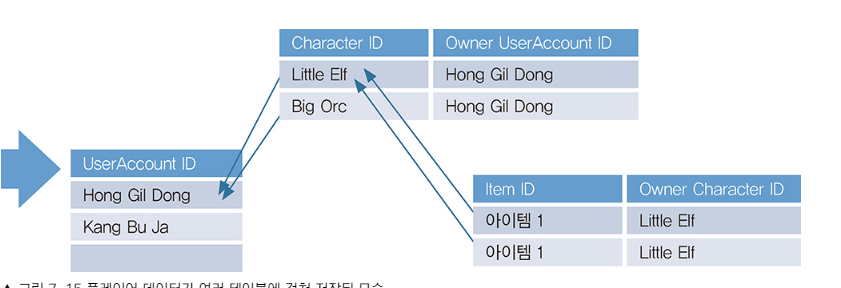
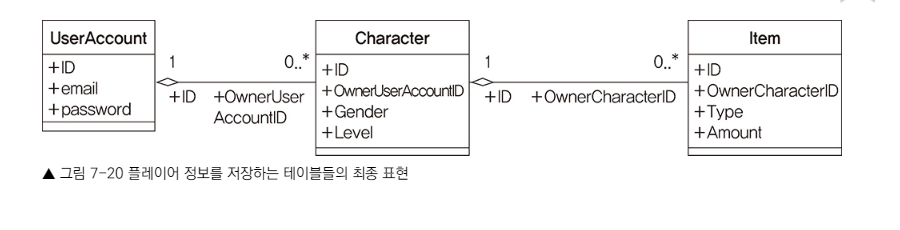

## 개요 

- 신입시절 게임서버프로그래밍 교과서를 읽었었는데, 한번 더 경험을 위해 글을 정리하면서 읽으려고했습니다. 

## 데이터베이스 

- 데이터베이스를 왜 사용하는 가? 

    - 게임서버에서 데이터를 저장할 때 데이터베이스외에 파일에도 데이터를 저장할 수 있다. 파일 서버를 둘 수도있고.. 

    - 그렇지만 데이터베이스를 사용하는 이유는 Transaction을 사용할 수 도있고(아이템 거래시 문제가 있을 때 rollback, 거래시 발생하는 행위들에 대해 원자성 보장),
    - 데이터를 빠르게 조회하면서 원하는 형태로 가공하기가 쉽다. 

- 계정, 캐릭터, 아이템의 관계 
    - 하나의 계정은 여러 캐릭터들을 소유할 수 있고, 하나의 캐릭터는 여러 아이템들을 소유할 수 있다. 이러한 것들이 1 대 다를 가진다고 보면된다. 
    - 아래 그림은 게임서버프로그래밍에서 말한 예제 모습이다. 
  
- 

- 
  - 위 그림을 살펴보면 0..*의 의미는 0개 혹은 그이상 (하나의 account는 여러 character를 가질 수 있다.)
  - 다이아몬드는 소유를 알릴 수있다. 
    - userAccount의 ID가 Character 테이블의 OWnerUserAccountID와 관계가 있다. (외래키)
    - Character 테이블은 OwnerUserAccountID라는 외래키를 가지고 있습니다. 이 외래키는 UserAccount 테이블의 ID를 참조합니다. 
    - Item 테이블은 OwnerCharacterID라는 외래키를 가지고 있습니다. 이 외래키는 Character 테이블의 ID를 참조합니다.
  
- 쿼리문 
    - 
## 해킹 

- 치트 
    - 게임쪽에서 사용하는 용어 캐릭터의 능력치를 비약적으로 상승시킴. 

- 크래킹 
    - 일반적인 해킹이라고 생각하면된다, 개인의 개인정보를 탈취하는 것

# 실무에서 알려주지 않는 17가지 실무 개발 기술 

## 프로토버퍼 
- 프로토버퍼를 왜 사용하는 가 ? 프로토버퍼는 일단 결론적으로 말하면 성능이 우월하다. 
- ?? Json도 직렬화하면 둘다 바이트스트림이라서 동일한 형태로 만들어지는 것이 아닌가 ?? 
    - Json은 직렬화 시 소요되는 cpu 연산량도 많다고한다. 
    - JSON은 사람이 눈으로 보기에는 좋은 만큼 컴퓨터에는 비효율적이다. 
- 클라, 서버 같은 Json데이터를 바라보고있을 때 한쪽은 데이터를 변경 후 전송을 한 상태에서 다른 쪽은 변경된 데이터를 update하지 않았을 경우 통신에 문제가 발생한다. 
- 프로토버퍼 중 여러필드를 모두 사용하지 않고 그중 특정 필들만 사용할 때는 OneOf 를 사용..

## Base64 

  Base 64 -> 인코딩시 데이터 길이가 더 길어지는 단점이 존재한다. 
-> 패딩적용이 필요함 
-> 패딩 적용이 필요한 이유는 tcp같은 stream 전송 방식에서 3, 3, 3 끊어진 후 1 이왔을 때 해당 1이 모두 온 것인지, 아니면 추가로오는 데이터가 존재해서 대기를 해야하는 것인지 알 수가 없다. 그래서 해당 부분을 예방하기 위해서 3, 3, 3 , 그리고 1이 왔을 때는 패딩을 위해 =을 1개 or 2개를 추가하는 행위를 한다.

패딩의 목적은 인코딩된 데이터의 길이가 올바르게 유지되도록 하여 디코딩 시에 원본 데이터의 정확한 길이를 복원할 수 있도록 하는 것입니다.

## UUID 
- universial unique identity 
- 유일성을 보장한다고 보면된다. 
- uudi를 왜 사용하는가?
    - 식별이 필요한 개체들이 존재할 때 uuid를 생성시킨 후, db에 데이터를 기록한다.
    - 이때 아주 낮은 확률 (왜냐? uuid는 16바이트(128비트) 길이로 생성됩니다)로 동일한 값이 있을 수도있는데 이럴 때는 동일한 값이 있는지 확인 후 재생성 절차를 거치면된다. 
    -  일반적으로 UUID는 8-4-4-4-12의 형식으로 총 36문자로 표현됩니다
        - ex : 550e8400-e29b-41d4-a716-446655440000

## CORS 

- 