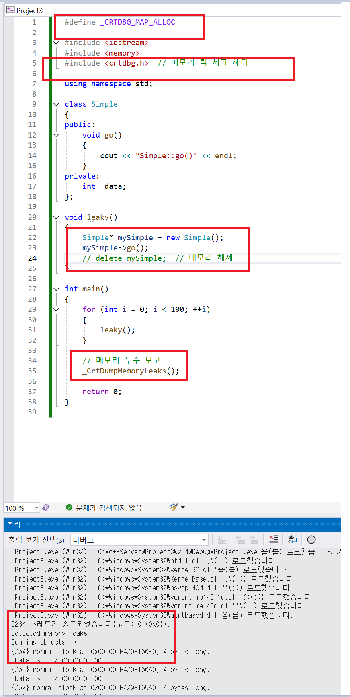

## memory 

- c++에서 메모리 누수를 확인할 수 있다.


````c++

#define _CRTDBG_MAP_ALLOC

#include <iostream>
#include <memory>
#include <crtdbg.h>  // 메모리 릭 체크 헤더

using namespace std;

class Simple
{
public:
	void go()
	{
		cout << "Simple::go()" << endl;
	}
private:
	int _data;
};

void leaky()
{
	Simple* mySimple = new Simple();
	mySimple->go();
	// delete mySimple;  // 메모리 해제
}

int main()
{
	for (int i = 0; i < 100; ++i)
	{
		leaky();
	}

	// 메모리 누수 보고
	_CrtDumpMemoryLeaks();

	return 0;
}


````




- 위코드에서 Simple 개체를 생성했지만 delete를 하지 않은 모습으로 인해 memory leak이 감지됐다..


## unique_ptr

- unique_ptr은 개체를 소유권을 하나만 유니크하게 인정하는 스마트 포인터이다.

- 하나의 소유권만 가능하기에  = 연산이 기본적으로는 막혀있자만, std::move의 이동 시멘틱을 이용한다면 가능하다.

- 컴파일러는 템플릿 타입을 클래스 템플릿 생성자로 전달된 인수를 보고 추론할 수있도록 CTAD이 적용되지만 unique_ptr과 shared_ptr에는 적용되지않는다.


### 사용 

````c++
#define _CRTDBG_MAP_ALLOC

#include <iostream>
#include <memory>
#include <vector>

using namespace std;

class Simple
{
public:

	Simple() = default;

	void go()
	{
		cout << "Simple::go()" << endl;
	}
private:
	int _data;
};

void foo(unique_ptr<Simple> p)
{
	p->go();
}

int main()
{
	auto myuniqu_ptr = make_unique<Simple>();

	vector<int> v = { 1, 2, 3, 4, 5 };
	//CTAD - Class Template Argument Deduction
	vector v { 1, 2, 3, 4, 5 };

	//CTAD UNIQUE_PTR
	auto myuniqu_ptr2 = make_unique<Simple>();


	//C++17이전에는  memory 누수가 발생했음 ..  Simple 생성자에서 exception이 발생했을 때 ... 
	foo(unique_ptr<Simple>(new Simple()));
	//그래서 아래와 같이 사용했지만, 이제는 위 방식도 가능함.
	foo(make_unique<Simple>());


	return 0;
}

````

### unique_ptr_reset_release

````c++

#define _CRTDBG_MAP_ALLOC

#include <iostream>
#include <memory>
#include <vector>

using namespace std;

class Simple
{
public:

	Simple() = default;

	void go()
	{
		// cout << "Simple::go()" << endl;
	}

	void setData(int data)
	{
		_data = data;
	}
private:
	int _data;
};

void foo(unique_ptr<Simple> p)
{
	p->go();
}

int main()
{
	auto myuniqu_ptr2 = make_unique<Simple>();


	//myuniqu_ptr2.reset(); // resource 해제 후 nullptr로 초기화 
	// myuniqu_ptr2->setData(100); // nullptr이므로 런타임 에러 발생

	myuniqu_ptr2.reset(new Simple()); // resource 해제 후 nullptr로 초기화  후 새로운 객체로 초기화
	myuniqu_ptr2->setData(100); //정상동작 

	return 0;
}


````


## 메모리 누수

- new delete를 빠짐 없이 사용하더라도 문제가 발생할 수 있다.

- 포인터를 받는 매개변수에서 기존의 원본 영역 메모리를 제거하지 않고, 다른 메모리 공간을 가리키게된다면 기존의 영역은 미아가 된다 

````c++
#define _CRTDBG_MAP_ALLOC

#include <iostream>
#include <crtdbg.h>

using namespace std;

class Simple
{
public:
	Simple() { m_intPtr = new int; }
	~Simple() { delete m_intPtr; }

	void setValue(int value) { *m_intPtr = value; }

private:
	int* m_intPtr;
};

void doSomething(Simple* outSimplePtr)
{
	outSimplePtr = new Simple(); // 여기서 문제가 발생함 기존제 가리키전 Simple 객체는 가리키지 않음.. 
}

int main()
{

	_CrtSetDbgFlag(_CRTDBG_ALLOC_MEM_DF | _CRTDBG_LEAK_CHECK_DF);  // 메모리 누수 감지 활성화

	Simple* simple = new Simple{};
	doSomething(simple);


	delete simple;
	return 0;
}
````

## Shared_ptr

- smart pointer는 일단 raw pointer를 wrapping한 것이다.
- 아래 class MyInt도 동일하게 스마트포인터라고 볼 수 있다. 물론 refcount는 없지만.. 

````c++

class MyInt
{
public:
	explicit MyInt(int* p = nullptr)
	{
		data = p;
	}

	~MyInt() { delete data; }

	int& operator * () { return *data; }
private:
	int* data{ nullptr };
};

````

- shared_ptr에서 reference count인 control block은 thread safe하다. 그렇지만 어떠한 개체 타입인지 가리키는 T*는 thread safe하다.
- make_shared<>()는 메모리 할당 후 개체 타입을 정하는 것이라서 new 키워드가 없다. 
- shared_ptr에서 ref count 보는 매서드는 object.use_count()

````c++
class Foo
{
public:
	Foo(int x) : _x{x} {}
	int getX() { return _x; }
	~Foo() { std::cout << "~Foo" << std::endl; }
private:
	int _x = 0;
};

void fun(std::shared_ptr<Foo> sp)
{
	std::cout << "fun : " << sp.use_count() << std::endl;
}

int main()
{
	//int* p = new int(10);
	//MyInt myint = MyInt(p); // P의 POINTER를 PASSING TO MyInt ... p포인터를 MyInt로 넘긴다. 
	//std::cout << *myint << std::endl;

	//shared_ptr<> p(new Foo()).. 
	// sp0, sp1, sp2... Foo개체를 가리키는 스마트포인터들이 증가하낟.
	// -> 어떤 개체인지, 또 다른 것은 control block ->,,, 

	//shared_ptr에서 reference count인 control block은 thread safe하지만, 어떤 객체인지 가리키는 T*는 thread safe
	// 하지 않다. 

	// make_shared는 미리 메모리 할당한 후 개체 타입을 정하는 것이라서 new 키워드가 없다 
	// shared_ptr -> ref count 보는 것은 object.use_count
	std::shared_ptr<Foo> sp = std::make_shared<Foo>(200);
	std::cout << sp.get() << std::endl;
	std::cout << sp.use_count() << std::endl; // reference count, -> thread safe
	std::shared_ptr<Foo> sp1(new Foo(100));
	std::shared_ptr<Foo> sp2 = sp;
	std::cout << sp.use_count() << std::endl;


	//====================== 스마트 포인터 함수 매개변수로 전달 하면서 thread로 실행하기 
	std::thread t1(fun, sp), t2(fun, sp), t3(fun, sp);

	std::cout << "main : " << sp.use_count() << std::endl;
	t1.join(); t2.join(); t3.join();
	//주목할 점은 ~ deconstructor은 한번만 호출된다. 
}

````

- 위 소스에서 fun함수의 매개변수에서 타입을 shared_ptr로 받고있다. 받으면서 내부적으로 ref count를 실행하면 호출된 thread 수 만큼 증가하지만 중요한 점은 마지막에 deconstructor는 한번만 호출된다는 점이다. 

- 스마트포인터의 중점은 new로 생성된 object의 life time을 관리한다고 볼 수 있다.

- 

## shared_ptr의 단점 순환 참조 

````c++

#include <iostream>
#include <memory>

class B;  // Forward declaration

class A {
public:
    std::shared_ptr<B> b_ptr;
    ~A() { std::cout << "A destroyed\n"; }
};

class B {
public:
    std::shared_ptr<A> a_ptr;
    ~B() { std::cout << "B destroyed\n"; }
};

int main() {
    std::shared_ptr<A> a = std::make_shared<A>();
    std::shared_ptr<B> b = std::make_shared<B>();

    a->b_ptr = b;  // A가 B를 가리킴
    b->a_ptr = a;  // B가 A를 가리킴 (순환 참조 발생)

    return 0;
}

````

- 위코드는 순환참조가 발생하는 코드이다. A 인스턴스는 

- https://www.youtube.com/watch?v=dtEGd30T8Rk

## placement_new 


- 기존의 new 연산은 메모리 할당 -> 객체를 생성자를 이용하여 초기화를 진행한다. 그렇지만 placement new를 이용하게된다면 미리 할당 된 메모리에 개체를 생성만 하면 되기에 하나의 스텝이 줄어들어서 메모리 관리에 효율성이 높아진다. 

````c++
#include <iostream>

using namespace std;

class MyClass
{
public:
	MyClass(int v) : value(v) { cout << "constructed : " << value << endl; }
	~MyClass() { cout << "Destroyed: " << value << endl; }

private:
	int value = 0;
};

int main()
{
	void* mem = operator new(sizeof(MyClass));

	auto target = new(static_cast<MyClass*>(mem)) MyClass(20);


	return 0;
}

````


## std:: move

````c++
#include <iostream>
#include <string>
#include <memory>

using namespace std;


class MyClass {
public:
	MyClass(int value) : value_(value) {
		std::cout << "MyClass(" << value_ << ") constructed\n";
	}
	~MyClass() {
		std::cout << "MyClass(" << value_ << ") destroyed\n";
	}

	int getValue() const { return value_; }

private:
	int value_;
};


int main()
{
	std::string str = "Hello world";
	std::string moved_str = std::move(str);

	cout << "moved str : " << moved_str << endl; // 소유권이 이전 됌 , std::move 시멘틱을 활용하면 모든 것을 복사 하지 않음 
	cout << "origin str : " << str << endl; // 더 이상 유효하지않음 출력 안돼 

	// 메모리 포인터나 리소스는 이동된 객체로 넘겨짐.
	// 기존 객체는 '비어 있는' 상태로 남게 됩니다.

	//ex2 포인터는 별  의미 없다 

	int* p1 = new int(10);
	int* p2 = std::move(p1);

	cout << "p2 : " << p2 << endl;
	cout << "p1 : " << p1 << endl;

	*p1 = 200;

	cout << *p2 << endl;


	// std::move는 큰 개체 복사 대신 소유권을 이전하여 데이터 복사 비용을 줄여서 성능을 향상하는 목적이 도모됌 

	//ex 3 unique_ptr  std::move 
	std::unique_ptr<MyClass> ptr1 = make_unique<MyClass>(10);

	//소유권이전
	//기본적으로 unique_ptr은 = 연산이 불가능하다 , 왜냐 독립 유니큰 포인터이기에 그렇다 하나의 리소스 단일 독점 
	unique_ptr<MyClass> ptr2 = std::move(ptr1);

	if (ptr1 == nullptr)
	{
		cout << "ptr1 is nullptr" << endl;
	}


	return 0;
}
````

- std::move는 주어진 객체를 r-value로 취급하여 이동할 수 있도록 합니다. 즉, 소유권이 더 이상 원본 객체에 필요하지 않음을 나타냅니다.
