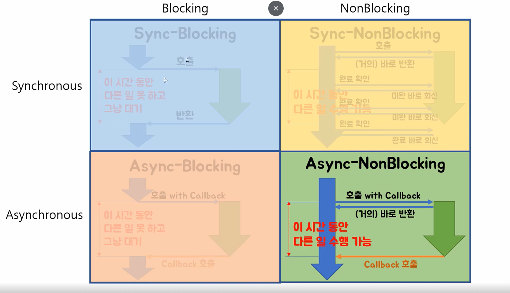

#### Blocking vs Non-Blocking IO
- blocking IO
    - 시스템 콜 (시스템 콜은 응용 프로그램이 운영 체제의 기능을 사용할 수 있게 합니다, cf : fopen.. iotcl)요청시 -> 커널 IO 작업 완료 시 까지 응답 대기 (카톡이 blocking이면 답올때까지 기다려야한다...)
    - 제어권이 io 작업에게 있다..(IO(입력, 출력)작업) -> 커널 소유 -> 응답(response)전까지 대기(Block) -> 다른 작업 수행 불가(대기)
    - 동시성을 위해서는 non block으로 작업해야한다.

    - ex : 프로세스가 파일에 IO 작업을 할 때 작업을 시작하고 USER MODE -> KERNEL MODE-> HW까지 가서 완료될 때까지 기다리는 것이 BLOCKING IO로 보면된다

- Non-blocking IO
    - 시스템 콜 요청시 => 커널 IO 작업 완료 여부 상관없이 즉시 응답 (실제 카톡도 이러하다..)
    - 제어권이 IO작업 -> 유저 프로세스 -> 다른작업 수행 가능(지속) -> 주기적으로 시스템 콜 통해서 IO 작업 완료 여부 확인 
    
    - NON BLOCKING 요청은 CALL 한 후 다른일을 할 수 있다. (call한 부분은 확인해볼 때 pending 상태일 수 있다 왜냐 작업 완료가 안됐으니.)

- Async vs Sync
    - Async : IO 작업 완료 여부에 대한 Noty는 커널(호출되는 함수) -> 유저 프로세스 (호출하는 함수), 결과를 바로 처리하지 않아도된다
        -> Async는 결과 noty가 커널에서 유저프로세스이기에 어떠한 '다른' 작업을하고있다가 완료통지가 오게된다면 알 수있다.
        -> callback 함수로 생각해도된다.
    - sync  : IO 작업 완료 여부에 대한 Noty는 유저프로세스(호출하는 함수) -> 커널(호출되는 함수), 결과를 바로 처리해야한다 
        ->   sync가 드어간다면 '완료 여부'를 유저프로세스에서 커널로 확인해야하기에 주기적으로 확인하는 작업이들어간다. 
"""

### non-block, block, async, sync

#### 출처 인프러 파이썬 고수가 되는 파이썬 : 동시성과 병렬성 문법 배우기 Feat. 멀티스레딩 vs 멀티프로세싱 (Inflearn Original)